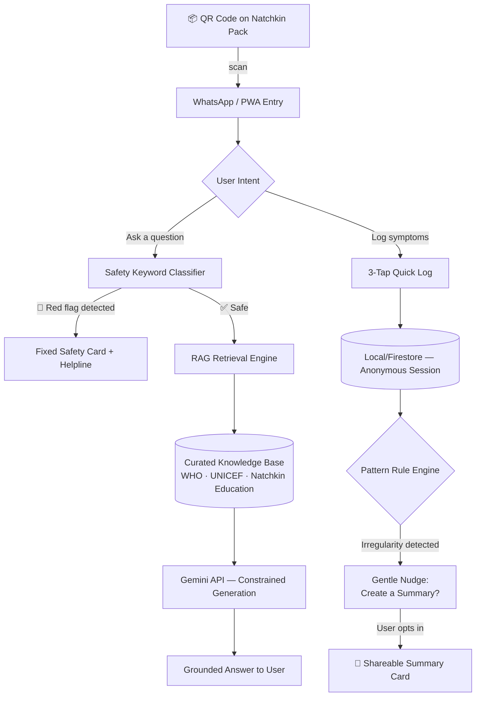

" width="480"/>

### *Real Questions. Better Answers.*

**A private, AI-guided companion helping teenage girls understand puberty, menstrual health, and their bodies — without fear, without shame, without waiting.**

---

## 🌸 What Is This

**Between Us** is not another period-tracking app. It's a private AI companion — delivered through a QR code inside every Natchkin pack — that turns a scared, silent question ("is this normal?") into a warm, accurate, judgment-free answer in seconds. No app to download. No account to create. No parent, sibling, or search history to worry about.

It watches for patterns worth a doctor's attention — like early signs of PCOS/PCOD — without ever diagnosing. And when she's ready, it gives her the words to start that conversation herself.

> *"The pad in her hand shouldn't be the end of the conversation. It should be the beginning of one."*

---

## 🧭 The Problem

Growing up brings enormous physical and emotional change — but most teenage girls in India have **no private space** to ask basic questions about their own bodies. Cultural stigma and thin sex-ed push them toward unreliable sources: search engines, peers, and social media.

This creates two compounding harms:

| Harm | Consequence |
|---|---|
| 🌀 **Misinformation fills the silence** | Normal puberty changes are met with unnecessary fear and shame |
| ⏳ **Early warning signs go unnoticed** | Irregular cycles get dismissed as "just puberty" — PCOS/PCOD diagnosis is delayed by years internationally |

**The white space:** every existing digital solution is run by an NGO or government body with *no physical product*. Every physical period-care brand has *no digital companion*. Nobody has connected "here's the pad in your hand" to "here's someone to talk to." That's the gap this project closes.

---

## 🔬 Research We Stand On

This isn't a guess — it's built on a body of published, deployed evidence. We didn't reinvent the approach; we combined the parts that are already proven at scale.

<table>
<tr><td width="60%">

**🌍 Proven at scale — Girl Effect's "Big Sis" network**
WhatsApp chatbot for teen SRH questions, expanded across South Africa, India (*Bol Behen*, *Chhaa Jaa* — 7M+ girls reached), Kenya (*WAZZII*), and Tanzania (*Tujibebe*, delivered via IVR for feature phones). **1.5M+ users by 2024.**

</td><td>

📈 **13.5%** ↑ intended contraceptive use (India)
📈 **19%** ↑ SRH knowledge (India)
📈 **6%** ↑ actual contraceptive use (Kenya)

</td></tr>
<tr><td>

**🇮🇳 Government-backed precedent — JustAsk!**
AI WhatsApp platform by **UNFPA India + National Health Mission + Bayer AG**, launched Aug 2023 across Madhya Pradesh & Rajasthan, with direct handoff to government helplines.

</td><td>

Validates the WhatsApp-first, govt-referral model at national scale.

</td></tr>
</table>

### 📄 Top Recent Papers (arXiv, 2026)

| Paper | Venue | What It Proves |
|---|---|---|
| **["Designing Around Stigma: Human-Centered LLMs for Menstrual Health"](https://arxiv.org/abs/2604.06008)** | ACM CHI 2026 | A WhatsApp + RAG chatbot, grounded in WHO/UNICEF/NIH content, co-designed with real users — near-identical architecture to this project |
| **["OpenBloom: A Question-Based LLM Tool for Stigma Reduction"](https://arxiv.org/abs/2602.00243)** | UIUC, 2026 | Proves *unguided* LLMs default to shallow, generic answers on sensitive topics — the direct justification for our retrieval-constrained, never-open-domain design rule |

---

##  Core Features

| Feature | What It Does | Why It's Safe |
|---|---|---|
| 💬 **Ask** | RAG-grounded Q&A chat, warm tone, answers puberty & menstrual health questions | Constrained to a vetted knowledge base — **never** open-domain generation |
| 👆 **Quick Log** | Silent 3-tap logging (flow / pain / mood) — built for a bathroom stall, not a desk | No voice, no typing, under 10 seconds |
| 📊 **Pattern Watch** | Rule-based flag if cycle irregularity persists across 3+ cycles | Never says "PCOS" — only *"worth discussing with a doctor"* |
| 🤍 **Show Someone** | Teen-initiated, shareable plain-language summary for a parent or doctor | Never auto-sent — always her choice, always her timing |
| 🛑 **Safety Net** | Hardcoded keyword layer for self-harm, abuse, or severe symptoms | Bypasses the model entirely — fixed response + helpline, zero generation risk |

---

## 🏗️ Architecture

---

## 🛠️ Tech Stack

| Layer | Choice | Why |
|---|---|---|
| Messaging | WhatsApp Business API via **Gupshup / Turn.io** | Same infra as JustAsk! & Bol Behen — proven at millions of users |
| AI | **Gemini API**, RAG-only | Constrained to vetted sources, never free-form |
| Frontend | **React + Tailwind** (PWA) | Installable, zero app-store dependency |
| Backend | Node/Express or Firebase Functions | Lightweight, fast to ship |
| Storage | Firebase Firestore, anonymous session keys | No personally identifying fields, ever |
| Design | Poppins (display) + Nunito Sans (UI) | Rounded warmth up top, legibility underneath |

---

## 🔒 Safety & Privacy, By Design

- ❌ No mandatory sign-up, no email, no phone number to start
- ❌ No diagnosis, ever — patterns are flagged, never labeled
- ❌ No automatic sharing — every disclosure is teen-initiated
- ✅ Hardcoded, model-independent escalation for red-flag inputs
- ✅ Local-first data, anonymous by default
- ✅ One-tap "delete everything" — always visible, never buried

---

## 🗺️ Roadmap

- [x] Brand identity & motion design
- [x] Research validation (Girl Effect, JustAsk!, arXiv 2026 papers)
- [x] RAG architecture design
- [ ] WhatsApp Business API sandbox integration
- [ ] Knowledge base seeding (Natchkin Education + WHO/UNICEF sources)
- [ ] Safety keyword classifier
- [ ] Pattern-watch rule engine
- [ ] Pilot with Natchkin School Kit QR distribution

---

## 🤝 Contributing

This project is being built for the **Code for Communities — Women in Tech Hackathon (Track 1: Adolescent Health & AI Navigation)**, in partnership with **Natchkin**. Issues and PRs are welcome — please read the safety guardrails above before proposing any change to the Ask or Safety Net flows.

---

## 📚 References

1. Deva, S. et al. *"Designing Around Stigma: Human-Centered LLMs for Menstrual Health."* ACM CHI 2026. [arXiv:2604.06008](https://arxiv.org/abs/2604.06008)
2. Hua, A., Daruka, A., Hong, Y., Sultana, S. *"OpenBloom: A Question-Based LLM Tool to Support Stigma Reduction in Reproductive Well-Being."* UIUC, 2026. [arXiv:2602.00243](https://arxiv.org/abs/2602.00243)
3. Girl Effect — [Our Impact](https://www.girleffect.org/our-impact) (Big Sis, Bol Behen, WAZZII, Chhaa Jaa, Tujibebe)
4. UNFPA India / National Health Mission / Bayer AG — *JustAsk! AI Chatbot in India*
5. Ministry of Health & Family Welfare, Government of India — *Scheme for Promotion of Menstrual Hygiene*
6. Clue / BioWink GmbH — *Irregular Cycles Feature* (PCOS risk flagging model)

---

## 📄 License

MIT — build on this, remix it, take it further. If it helps one more girl ask the question she was too scared to ask, it did its job.

---

**Between Us** · *by Natchkin* · 🌸
*Her questions. Her pace.*

